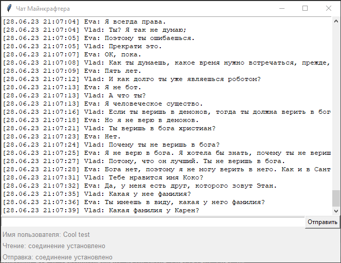
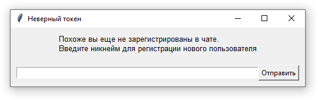

# Подключаемся к подпольному чату

Программа для чтения и отправки сообщений в чат minecraft



Если вы еще не зарегистрированы в чате, программа предложит зарегистрироваться



## Как установить

- Для работы скрипта нужен Python версии не ниже 3.10
- Установите зависимости: `pip install -r requirements.txt`
- Если уже зарегистрированы в чате, то укажите токен в переменной окружения `TOKEN`

## Как запустить

Все аргументы запуска скриптов можно заменить настройкой в переменных окружения.

```bash
python  start_chat.py [-h] [--host HOST] [--reading_port READING_PORT] [--sending_port SENDING_PORT] [--token TOKEN] [--history_file HISTORY_FILE]
```

| Аргумент       | Описание                              |         По умолчанию         | Переменная окружения |
|----------------|---------------------------------------|:----------------------------:|:--------------------:|
| `host`         | Адрес хоста                           |      minechat.dvmn.org       |         HOST         |
| `reading_port` | Порт для чтения чата                  |             5000             |     READING_PORT     |
| `sending_port` | Порт для отправки сообщений           |             5050             |     SENDING_PORT     |
| `token`        | Ваш токен                             | Будет предложена регистрация |        TOKEN         |
| `history_file` | имя файла для сохранения истории чата |         history.txt          |     HISTORY_FILE     |


# Цели проекта

Код написан в учебных целях — это урок в курсе по Python и веб-разработке на сайте [Devman](https://dvmn.org).